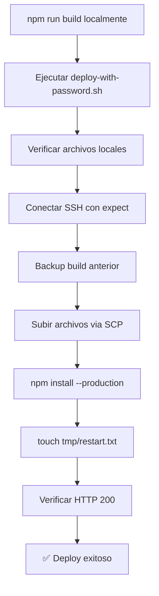

# Método de Deploy SSH a Hostinger

**Versión:** 2.3.12
**Fecha:** 2026-06-09
**Estado:** ✅ FUNCIONANDO

---

## 🔑 Método que Funciona

Usamos **`expect`** para automatizar la autenticación SSH con contraseña.

### Credenciales SSH

```bash
Host: 185.173.111.183
Puerto: 65002
Usuario: u616221621
Contraseña: Taroti2026!
Path: /home/u616221621/domains/dimgrey-louse-600796.hostingersite.com/nodejs
```

---

## 📜 Script de Deploy

**Ubicación:** `/Users/dr.herrera/Figotilabs/taroti LATAM/deploy-with-password.sh`

### Uso:

```bash
cd "/Users/dr.herrera/Figotilabs/taroti LATAM"
./deploy-with-password.sh
```

### Lo que hace el script:

1. ✅ Verifica archivos locales (build/, package.json, start-server.js)
2. ✅ Crea backup del build anterior en el servidor
3. ✅ Sube archivos usando SCP con expect
4. ✅ Instala dependencias (`npm install --production`)
5. ✅ Reinicia Passenger (`touch tmp/restart.txt`)
6. ✅ Verifica que el sitio responda

---

## 🛠️ Comandos Individuales

### Conectar por SSH:

```bash
cat > /tmp/ssh_connect.exp << 'EOF'
#!/usr/bin/expect -f
set timeout 30
set password "Taroti2026!"
spawn ssh -p 65002 -o StrictHostKeyChecking=no u616221621@185.173.111.183
expect {
    "password:" {
        send "$password\r"
        interact
    }
}
EOF
chmod +x /tmp/ssh_connect.exp && /tmp/ssh_connect.exp
```

### Ejecutar comando remoto:

```bash
cat > /tmp/ssh_command.exp << 'EOF'
#!/usr/bin/expect -f
set timeout 30
set password "Taroti2026!"
set command [lindex $argv 0]
spawn ssh -p 65002 -o StrictHostKeyChecking=no u616221621@185.173.111.183 $command
expect {
    "password:" {
        send "$password\r"
        expect eof
    }
}
EOF
chmod +x /tmp/ssh_command.exp
/tmp/ssh_command.exp "ls -la ~/domains/dimgrey-louse-600796.hostingersite.com/nodejs"
```

### Subir archivo con SCP:

```bash
cat > /tmp/scp_upload.exp << 'EOF'
#!/usr/bin/expect -f
set timeout 120
set password "Taroti2026!"
set source [lindex $argv 0]
set destination [lindex $argv 1]
spawn scp -P 65002 -r -o StrictHostKeyChecking=no $source $destination
expect {
    "password:" {
        send "$password\r"
        expect eof
    }
}
EOF
chmod +x /tmp/scp_upload.exp
/tmp/scp_upload.exp "./build" "u616221621@185.173.111.183:/home/u616221621/domains/dimgrey-louse-600796.hostingersite.com/nodejs/"
```

---

## 📊 Flujo de Deploy Completo



---

## 🔍 Verificación Post-Deploy

### 1. Verificar que el sitio carga:

```bash
curl -I https://dimgrey-louse-600796.hostingersite.com
```

Debe responder: **HTTP/2 200**

### 2. Ver logs del servidor:

```bash
cat > /tmp/check_logs.exp << 'EOF'
#!/usr/bin/expect -f
set timeout 30
set password "Taroti2026!"
spawn ssh -p 65002 -o StrictHostKeyChecking=no u616221621@185.173.111.183 "tail -100 ~/domains/dimgrey-louse-600796.hostingersite.com/nodejs/stderr.log"
expect {
    "password:" {
        send "$password\r"
        expect eof
    }
}
EOF
chmod +x /tmp/check_logs.exp && /tmp/check_logs.exp
```

### 3. Verificar estructura de archivos:

```bash
cat > /tmp/check_files.exp << 'EOF'
#!/usr/bin/expect -f
set timeout 30
set password "Taroti2026!"
spawn ssh -p 65002 -o StrictHostKeyChecking=no u616221621@185.173.111.183 "ls -lh ~/domains/dimgrey-louse-600796.hostingersite.com/nodejs/"
expect {
    "password:" {
        send "$password\r"
        expect eof
    }
}
EOF
chmod +x /tmp/check_files.exp && /tmp/check_files.exp
```

---

## 🚨 Troubleshooting

### Error: "Permission denied"

**Causa:** Contraseña incorrecta o formato incorrecto.

**Solución:** Verificar que la contraseña es exactamente `Taroti2026!` (con mayúscula T y signo de exclamación)

### Error: "Connection timeout"

**Causa:** Puerto SSH incorrecto o firewall bloqueando.

**Solución:** Verificar puerto 65002 y que el servidor esté accesible.

### Error: "No such file or directory"

**Causa:** Path incorrecto en el servidor.

**Solución:** El path correcto es `/home/u616221621/domains/dimgrey-louse-600796.hostingersite.com/nodejs/`

### Error: "Module not found"

**Causa:** Build corrupto o node_modules desactualizados.

**Solución:**
```bash
# Limpiar y rebuild
rm -rf build .svelte-kit
npm run build
./deploy-with-password.sh
```

---

## ✅ Checklist de Deploy

Antes de cada deploy, verifica:

- [ ] `npm run build` completado sin errores
- [ ] Directorio `build/` existe localmente
- [ ] `.env.production` tiene credenciales correctas
- [ ] Script `deploy-with-password.sh` tiene permisos de ejecución
- [ ] Conexión a internet estable

Durante el deploy:

- [ ] Backup del build anterior creado
- [ ] Archivos subidos completamente (sin errores de SCP)
- [ ] `npm install --production` completado
- [ ] Passenger reiniciado (`tmp/restart.txt` tocado)

Post-deploy:

- [ ] Sitio responde con HTTP 200
- [ ] No hay errores en `stderr.log`
- [ ] Funcionalidad principal probada

---

## 📝 Notas Importantes

1. **NO usar sshpass directamente** - No funciona con la contraseña de Hostinger
2. **Usar expect** - Es el único método que funciona consistentemente
3. **Siempre hacer backup** - El script automáticamente hace backup del build anterior
4. **Verificar logs** - Después de cada deploy, revisar `stderr.log` para detectar errores temprano
5. **Passenger requiere restart manual** - Tocar `tmp/restart.txt` después de cambios

---

## 🔗 Referencias

- Script principal: `deploy-with-password.sh`
- Documentación Hostinger: [docs/DEPLOY-HOSTINGER.md](./DEPLOY-HOSTINGER.md)
- Variables de entorno: `.env.production`

---

**Última actualización:** 2026-06-09
**Última ejecución exitosa:** 2026-06-09 01:55 UTC
**Versión deployada:** 2.3.12 (con fixes de Mercado Pago)
